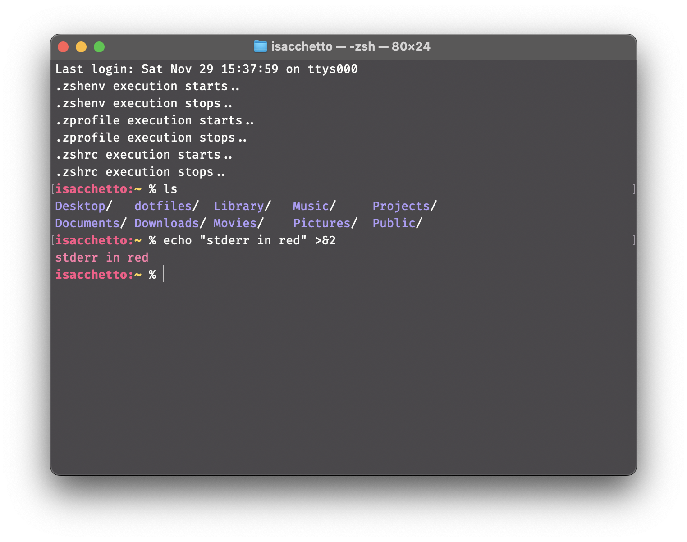

# Dotfiles Repository
Personal configuration files arranged as [GNU Stow](https://www.gnu.org/software/stow/) packages so they can be symlinked into place cleanly and overridden per host when needed.


### Screenshots


## Folder Structure

The repository is organized into directories for each application or tool. Each directory contains the relevant configuration files for that application.

```
dotfiles/
├── bash/
│   ├── .bashrc
│   └── .profile
├── zsh/
│   ├── dot-zshenv
│   └── dot-cofig/
│       └── zsh/
│           ├── .zshrc
│           └── .zprofile
├── git/
│   └── dot-cofig/
│       └── git/
│           ├── config
│           └── ignore
:
```

### Installation
1. **Install Stow**:  
   - macOS: `brew install stow`
   - Debian/Ubuntu: `sudo apt install stow`

2. **Clone the Repository**: Clone this repository to your $HOME directory or any directory you prefer (update `--dir` in `.stowrc` to match the location you choose):
    ```sh
    git clone https://github.com/isacchetto/dotfiles.git
    cd dotfiles
    ```
    
3. Prime Stow itself so the global config is in place:
   ```sh
   stow stow
   ```
   This links `.stowrc` and `.stow-global-ignore`, enabling the `--dotfiles` flag so Stow understands `dot-*` directories as real dotfile targets.
   
### How to Use Stow
1. **Stow a Package**: `stow <package>` is equivalent to `stow -S <package>`. `-S` (or `--stow`) creates the symlinks defined in that package.
    ```sh
    stow git
    ```
    
2. **Unstow a Package**: If you want to remove the symlinks created by Stow, you can unstow a package by running:
    ```sh
    stow -D git
    ```

3. **Relink / update**: first destroys the existing symlinks and then recreates them
    ```sh
    stow -R git
    ```

## Contributing

Feel free to fork this repository and make your own modifications. If you have any improvements or suggestions, please open an issue or submit a pull request.

## LICENSE
This repository is released under the MIT license. See [LICENSE](LICENSE) for details.
